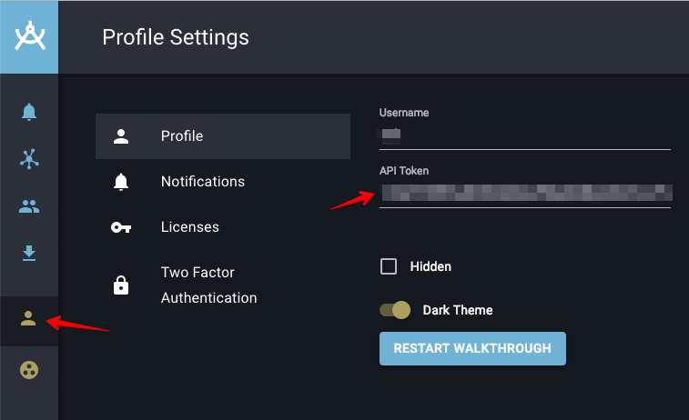

# Avalon for IBM Resilient

This package contains components that integrate Avalon with IBM Resilient. 

## Installation

Prerequisites:

```
resilient-circuits >=v30.0.0
```

To install in "development mode":

```
pip install -e ./avalon/
```

After installation, the package will be loaded by `resilient-circuits run`.

To uninstall:

```
pip uninstall avalon
```

To package for distribution:

```
python ./avalon/setup.py sdist
```

The resulting .tar.gz file can be installed using:

```
pip install fn_avalon<version>.tar.gz
```

## Configuration

1. Import the package's customization data into the Resilient Platform through the command:

	```
	resilient-circuits customize
	```
	
	This will create the following custom components:        
	
    Incident fields:
    
    * `avalon_auto_refresh`
    * `avalon_last_pull_time`
    * `avalon_workspace_id`
    
    Function inputs:
    
    * `incident_id`
    * `incident_name`
    
    Message Destinations:
    
    * `avalon_actions`
    
    Functions:
    
    * `avalon_refresh`
    
    Workflows:
    
    * `avalon_refresh`
    
    Rules:
    
    * `Avalon: Create Workspace`
    * `Avalon: Pull Nodes`
    * `Avalon: Push Artifact`
    * `Avalon: Push Artifacts`
    * `Avalon: Start Auto-refresh Workflow`
    * `Avalon: Stop Auto-refresh Workflow`
    
2. Update and edit `app.config` by first running:

	```
	resilient-circuits config [-u | -c]. 
	```
		
	Then edit the `[avalon]` section:
	
	```
	[avalon]
	base_url=<avalon-base-url>
	api_token=<avalon-api-token>
	```
	
	`base_url` have to be set to `https://avalon.kingandunion.com`. 
	
	The API token for your user can be found under [Avalon](https://avalon.kingandunion.com) > User > Profile Settings:
	
	     

## Selftest

Once you complete the configuratio , you can use the selftest command to do a basic connectivity test, as follows:

```
resilient-circuits selftest --list avalon
```

## Usage

See the [Tutorial](./doc/tutorial.md)