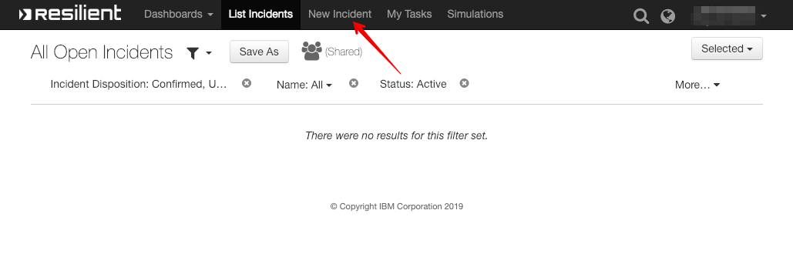
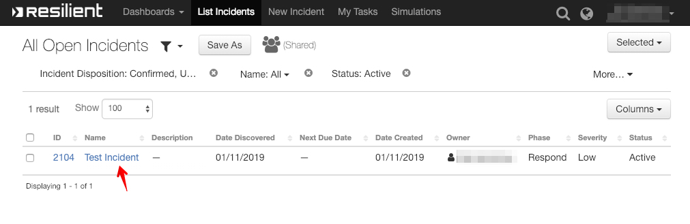

# Tutorial

[TOC]

How to use **Avalon for IBM Resilient**. 

## 1. Create a test incident

Login into IBM Resilient. Select New Incident to create a new incident for testing. Name it `Test Incident`:

 

After incident creation:

## 2. Create Avalon workspace

### Create

Navigate to the newly created incident in IBM Resilient and select `Avalon: Create Workspace` from the `Actions` menu:

### Verify

Check the Action Status in IBM Resilient:

Action Status should be `Completed` and information should say `Avalon workspace created successfully.`:

Login to Avalon. You should see a new workspace with the name `Test Incident (IBM Resilient)`: 

## 3. Enrich the Avalon workspace

### Add node

In Avalon, select node tool:

Click on canvas. Enter `attacker.com`. Click Save:

  

### Add enrichments

Avalon will find a few relationships to the new node. Click `Workspace`. Then click `+ ADD ALL`.

Avalon should add more nodes to the workspace:

## 4. Pull Avalon nodes into IBM Resilient

### Pull nodes

In IBM Resilient navigate to the incident. Select `Avalon: Pull Nodes` from the `Actions` menu:

### Check artifacts

In the incident, open the `Artifacts` tab. You should see `domain`, `url` and `ip` artifacts created for the corresponding Avalon nodes:

> NOTE: A special `Avalon Workspace` artifact indicates the incident is linked to an Avalon workspace. 

## 5. Push IBM Resilient artifacts to Avalon

### Add artifact

In the incident click `Add Artifact`: 

Choose `DNS Name` for type and set the value to `gogl.com`:

### Push artifact to Avalon

Click the `...` button next to the `gogl.com` artifact. Select `Avalon: Push Artifact`

### Check nodes

In Avalon, verify that a new `gogl.com` node has been added to the workspace:

 

## 6. Schedule automatic resfresh (optional)

### Start auto-refresh

To start an IBM Resilient workflow that pulls the Avalon nodes automatically every 60 minutes select `Avalon: Start Auto-refresh` from the `Actions` menu:

     

To stop the auto-refresh process, from the `Actions` menu select `Avalon: Stop Auto-refresh`. 

### Change auto-refresh time

Open the `Avalon` tab and click `Edit`. 

Enter number of minutes in the `Avalon: Auto Refresh Time`  field. Click `Save`. 

> NOTE: If you do not see the Avalon tab please contact your system adminstrator. Your system adminstrator can customize the incident layout to add the Avalon tab andthe  Avalon custom fields.  