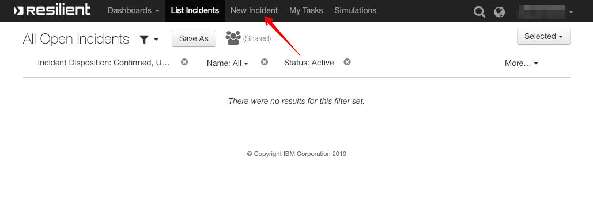
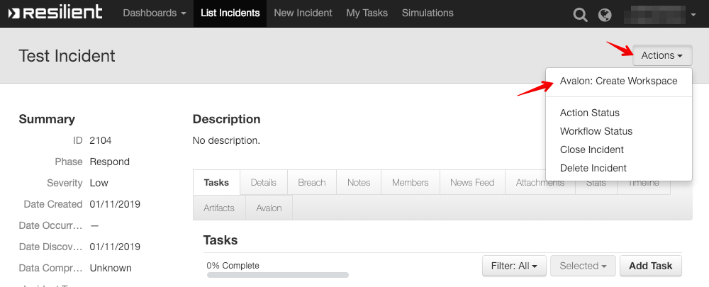

# User Guide

[TOC]

**Avalon for IBM Resilient** 

## Create a test incident

Login into IBM Resilient. Select New Incident to create a new incident for testing. Name it `Test Incident`:

 

After incident creation:

## Create Avalon workspace

Navigate to the newly created incident in IBM Resilient and select `Avalon: Create Workspace` from the `Actions` menu:

